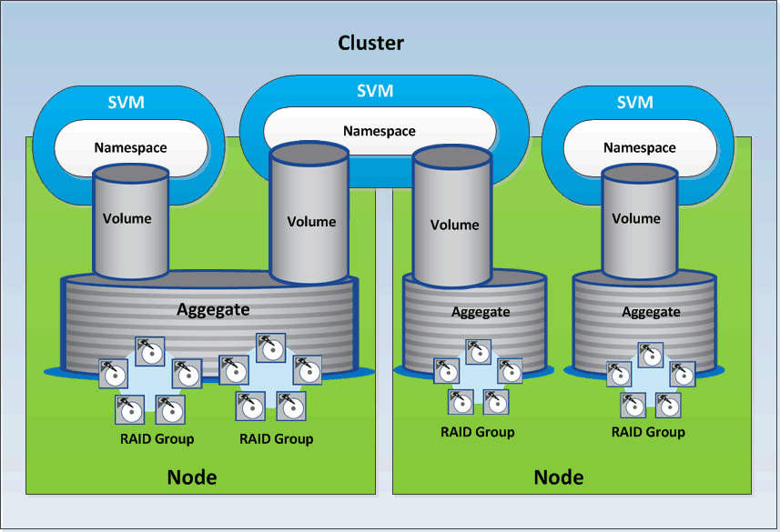

= Recursos de armazenamento no ONTAP
:allow-uri-read: 
:icons: font
:imagesdir: ../media/

[role="lead"]
Os recursos de armazenamento no ONTAP podem ser amplamente classificados em _recursos de armazenamento físico_ e _recursos de armazenamento lógico_. Para gerenciar efetivamente seus sistemas ONTAP usando as APIs fornecidas no Active IQ Unified Manager, você deve entender o modelo de recurso de armazenamento e o relacionamento entre vários recursos de armazenamento.

* *Recursos de armazenamento físico*
+
Refere-se aos objetos de armazenamento físico fornecidos pelo ONTAP.  Os recursos de armazenamento físico incluem discos, clusters, controladores de armazenamento, nós e agregados.

* *Recursos de armazenamento lógico*
+
Refere-se aos recursos de armazenamento fornecidos pelo ONTAP que não estão vinculados a um recurso físico.  Esses recursos estão associados a uma máquina virtual de armazenamento (SVM, anteriormente conhecida como Vserver) e existem independentemente de qualquer recurso de armazenamento físico específico, como um disco, LUN de matriz ou agregado.

+
Os recursos de armazenamento lógico incluem volumes de todos os tipos e qtrees, bem como os recursos e configurações que você pode usar com esses recursos, como cópias de instantâneo, desduplicação, compactação e cotas.

A ilustração a seguir mostra os recursos de armazenamento em um cluster de 2 nós:

