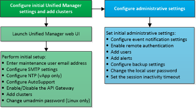

= Visão geral da sequência de configuração
:allow-uri-read: 
:icons: font
:imagesdir: ../media/

[role="lead"]
O fluxo de trabalho de configuração descreve as tarefas que você deve executar antes de poder usar o Unified Manager.

