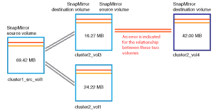

= Resolver problemas de atraso
:allow-uri-read: 
:icons: font
:imagesdir: ../media/

[role="lead"]
Este fluxo de trabalho fornece um exemplo de como você pode resolver um problema de atraso.  Neste cenário, você é um administrador ou operador acessando a página Unified ManagerDashboard para verificar se há algum problema com seus relacionamentos de proteção e, se houver, encontrar soluções.

.Antes de começar
Você deve ter a função de Administrador de Aplicativos ou Administrador de Armazenamento.

Na página Painel, você olha a área Incidentes e riscos não resolvidos e vê um erro de atraso do SnapMirror no painel Proteção em Riscos de proteção.

.Passos
. No painel *Proteção* na página *Painel*, localize o erro de atraso no relacionamento do SnapMirror e clique nele.
+
A página Detalhes do evento para o evento de erro de atraso é exibida.

. Na página de detalhes do *Evento*, você pode executar uma ou mais das seguintes tarefas:
+
** Revise a mensagem de erro no campo Causa da área Resumo para determinar se há alguma ação corretiva sugerida.
** Clique no nome do objeto, neste caso um volume, no campo Origem da área Resumo para obter detalhes sobre o volume.
** Procure por notas que possam ter sido adicionadas sobre este evento.
** Adicione uma nota ao evento.
** Atribua o evento a um usuário específico.
** Reconheça ou resolva o evento.

. Neste cenário, você clica no nome do objeto (neste caso, um volume) no campo Origem da área *Resumo* para obter detalhes sobre o volume.
+
A guia Proteção da página de detalhes Volume/Saúde é exibida.

. Na aba *Proteção*, você vê o diagrama de topologia.
+
Observe que o volume com o erro de atraso é o último volume em uma cascata SnapMirror de três volumes.  O volume selecionado é contornado em cinza escuro, e uma linha laranja dupla do volume de origem indica um erro de relacionamento do SnapMirror .

+

. Clique em cada um dos volumes na cascata do SnapMirror .
+
Conforme você seleciona cada volume, as informações de proteção nas áreas Resumo, Topologia, Histórico, Eventos, Dispositivos relacionados e Alertas relacionados mudam para exibir detalhes relevantes ao volume selecionado.

. Você olha para a área *Resumo* e posiciona o cursor sobre o ícone de informações no campo *Atualizar cronograma* para cada volume.
+
Neste cenário, você observa que a política do SnapMirror é DPDefault, e a programação do SnapMirror é atualizada a cada hora, cinco minutos após a hora.  Você percebe que todos os volumes no relacionamento estão tentando concluir uma transferência do SnapMirror ao mesmo tempo.

. Para resolver o problema de atraso, modifique os agendamentos de dois dos volumes em cascata para que cada destino inicie uma transferência do SnapMirror depois que sua origem tiver concluído uma transferência.

