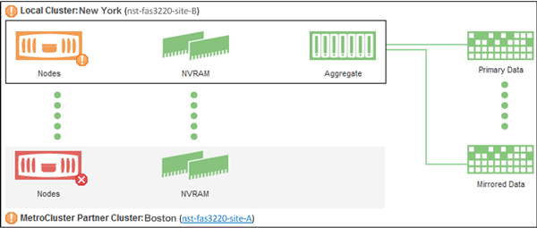

= Verifique a integridade dos clusters em uma configuração MetroCluster
:allow-uri-read: 
:icons: font
:imagesdir: ../media/

[role="lead"]
Você pode usar o Active IQ Unified Manager (Unified Manager) para verificar a integridade operacional dos clusters e seus componentes nas configurações do MetroCluster sobre FC e do MetroCluster sobre IP.  Se os clusters estiverem envolvidos em um evento de desempenho detectado pelo Unified Manager, o status de integridade pode ajudar a determinar se um problema de hardware ou software contribuiu para o evento.

.Antes de começar
* Você deve ter a função de Operador, Administrador de Aplicativos ou Administrador de Armazenamento.
* Você deve ter analisado um evento de desempenho para uma configuração do MetroCluster e obtido o nome do cluster envolvido.
* Ambos os clusters na configuração do MetroCluster sobre FC e IP devem ser monitorados pela mesma instância do Unified Manager.

== Determinar a integridade do cluster no MetroCluster por meio da configuração FC

Siga estas etapas para determinar a integridade do cluster em uma configuração MetroCluster sobre FC.

.Passos
. No painel de navegação esquerdo, clique em *Gerenciamento de eventos* para exibir a lista de eventos.
. No painel de filtros, selecione todos os filtros do MetroCluster na categoria *Tipo de fonte*.  Você vê todos os eventos gerados no seu ambiente para todas as configurações do MetroCluster .
. Ao lado de um evento do MetroCluster , clique no nome do cluster.
+
[NOTE]
====
Se nenhum evento do MetroCluster for exibido, você pode usar a barra de pesquisa para procurar o nome do cluster envolvido no evento relacionado à sua configuração do MetroCluster sobre FC.

====
+
A visualização Saúde: Todos os clusters é exibida com informações detalhadas sobre o evento.

. Selecione a aba * Conectividade do MetroCluster * para exibir a integridade da conexão entre o cluster selecionado e seu cluster parceiro.
+
image::../media/opm_um_mcc_connectivity_tab_png.gif[Guia Conectividade do Unified Manager MetroCluster]

+
Neste exemplo, os nomes e os componentes do cluster local e seu cluster parceiro são exibidos.  Um ícone amarelo ou vermelho indica um evento de integridade para o componente destacado.  O ícone Conectividade representa o link entre os clusters.  Você pode apontar o cursor do mouse para um ícone para exibir informações do evento ou clicar no ícone para exibir os eventos.  Um problema de saúde em qualquer um dos clusters pode ter contribuído para o evento de desempenho.

+
O Unified Manager monitora o componente NVRAM do link entre os clusters.  Se o ícone FC Switches no cluster local ou de parceiro ou o ícone Conectividade estiver vermelho, um problema de integridade do link pode ter causado o evento de desempenho.

. Selecione a aba * MetroCluster Replication*.
+

+
Neste exemplo, se o ícone da NVRAM no cluster local ou parceiro estiver amarelo ou vermelho, um problema de integridade com a NVRAM pode ter causado o evento de desempenho.  Se não houver ícones vermelhos ou amarelos na página, um problema de desempenho no cluster de parceiros pode ter causado o evento de desempenho.

== Determinar a integridade do cluster na configuração do MetroCluster sobre IP

Siga estas etapas para determinar a integridade do cluster em uma configuração MetroCluster sobre IP.

.Passos
. No painel de navegação esquerdo, clique em *Gerenciamento de eventos* para exibir a lista de eventos.
. No painel de filtro, na categoria *Tipo de fonte*, selecione o `MetroCluster Relationship` filtro.  Você vê todos os eventos gerados no seu ambiente para todas as configurações do MetroCluster .
+
[NOTE]
====
Se você não conseguir ver os eventos relatados do MetroCluster , poderá usar a barra de pesquisa para pesquisar pelo nome do cluster envolvido no evento relacionado à sua configuração do MetroCluster sobre IP.

====
. Ao lado do evento MetroCluster relevante, clique no nome do cluster.  A página Clusters é exibida com os detalhes desse cluster.  Para obter informações sobre como determinar problemas de saúde, consultelink:../storage-mgmt/task_monitor_metrocluster_configurations.html["Monitorar problemas de conectividade na configuração do MetroCluster sobre IP"] .

