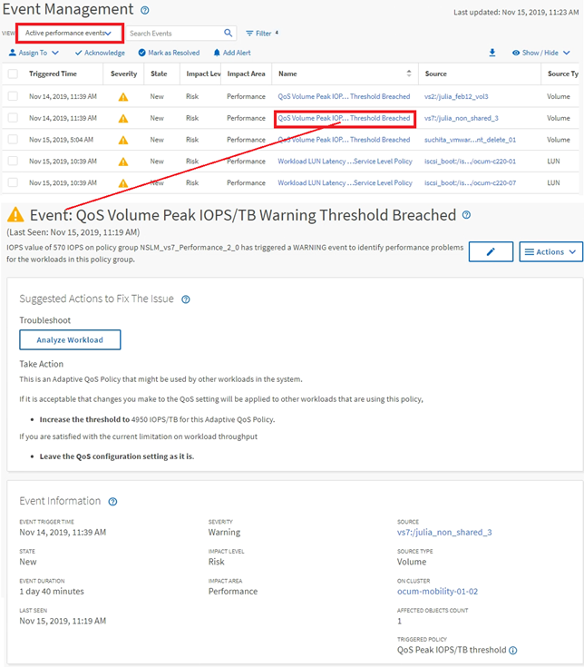

= Navegação de investigação de eventos
:allow-uri-read: 
:icons: font
:imagesdir: ../media/

[role="lead"]
As páginas de detalhes do evento do Unified Manager fornecem uma visão detalhada de qualquer evento de apresentação.  Isso é benéfico ao investigar eventos de desempenho, ao solucionar problemas e ao ajustar o desempenho do sistema.

Dependendo do tipo de evento de performance, você poderá ver um dos dois tipos de páginas de detalhes do evento:

* Página de detalhes do evento para eventos de política de limite definidos pelo usuário e pelo sistema
* Página de detalhes do evento para eventos de política de limite dinâmico

Este é um exemplo de navegação de investigação de eventos.

. No painel de navegação esquerdo, clique em *Gerenciamento de eventos*.
. No menu Exibir, clique em *Eventos de desempenho ativos*.
. Clique no nome do evento que você deseja investigar e a página Detalhes do evento será exibida.
. Veja a Descrição do evento e revise as Ações sugeridas (quando disponíveis) para ver mais detalhes sobre o evento que podem ajudar você a resolver o problema.  Você pode clicar no botão *Analisar carga de trabalho* para exibir gráficos de desempenho detalhados para ajudar a analisar melhor o problema.

