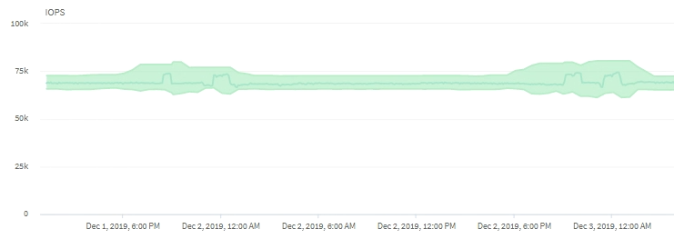

= Como as operações de cluster podem afetar a latência da carga de trabalho
:allow-uri-read: 
:icons: font
:imagesdir: ../media/

[role="lead"]
Operações (IOPS) representam a atividade de todas as cargas de trabalho definidas pelo usuário e pelo sistema em um cluster.  As estatísticas de IOPS ajudam a determinar se os processos de cluster, como fazer backups ou executar desduplicação, estão afetando a latência da carga de trabalho (tempo de resposta) ou podem ter causado ou contribuído para um evento de desempenho.

Ao analisar eventos de desempenho, você pode usar as estatísticas de IOPS para determinar se um evento de desempenho foi causado por um problema no cluster.  Você pode identificar as atividades específicas da carga de trabalho que podem ter sido os principais contribuintes para o evento de desempenho.  IOPS são medidos em operações por segundo (ops/seg).

Este exemplo mostra o gráfico IOPS.  As estatísticas operacionais reais são uma linha azul e a previsão do IOPS das estatísticas operacionais é verde.

[NOTE]
====
Em alguns casos em que um cluster está sobrecarregado, o Unified Manager pode exibir a mensagem `Data collection is taking too long on Cluster _cluster_name_` .  Isso significa que não foram coletadas estatísticas suficientes para o Unified Manager analisar.  Você precisa reduzir os recursos que o cluster está usando para que as estatísticas possam ser coletadas.

====