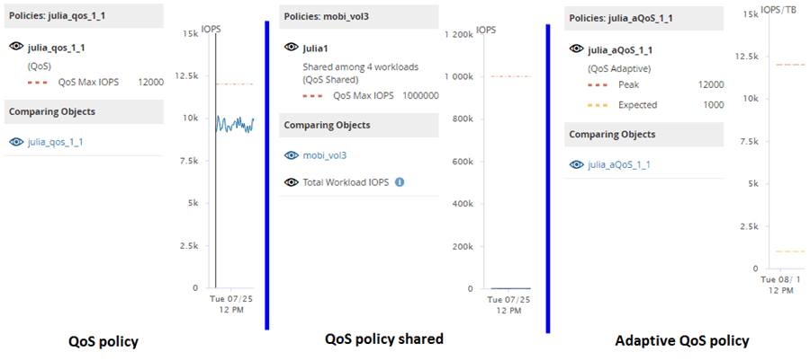

= Como diferentes tipos de políticas de QoS são exibidos nos gráficos de taxa de transferência
:allow-uri-read: 
:icons: font
:imagesdir: ../media/

[role="lead"]
Você pode visualizar as configurações de política de qualidade de serviço (QoS) definidas ONTAP que foram aplicadas a um volume ou LUN nos gráficos IOPS, IOPS/TB e MB/s do Performance Explorer e da Análise de Carga de Trabalho.  As informações exibidas nos gráficos são diferentes dependendo do tipo de política de QoS que foi aplicada à carga de trabalho.

Uma configuração de taxa de transferência máxima (ou "pico") define a taxa de transferência máxima que a carga de trabalho pode consumir e, portanto, limita o impacto em cargas de trabalho concorrentes pelos recursos do sistema.  Uma configuração de taxa de transferência mínima (ou "esperada") define a taxa de transferência mínima que deve estar disponível para a carga de trabalho para que uma carga de trabalho crítica atinja as metas de taxa de transferência mínima, independentemente da demanda de cargas de trabalho concorrentes.

Políticas de QoS compartilhadas e não compartilhadas para IOPS e MB/s usam os termos "`mínimo`" e "`máximo`" para definir o piso e o teto.  As políticas de QoS adaptáveis ​​para IOPS/TB, que foram introduzidas no ONTAP 9.3, usam os termos "`esperado`" e "`pico`" para definir o piso e o teto.

Embora o ONTAP permita que você crie esses dois tipos de políticas de QoS, dependendo de como elas são aplicadas às cargas de trabalho, há três maneiras pelas quais a política de QoS será exibida nos gráficos de desempenho.

|===
| Tipo de política | Funcionalidade | Indicador na interface do Unified Manager 

 a| 
Política compartilhada de QoS atribuída a uma única carga de trabalho ou política não compartilhada de QoS atribuída a uma única carga de trabalho ou a várias cargas de trabalho
 a| 
Cada carga de trabalho pode consumir a configuração de taxa de transferência especificada
 a| 
Exibe "`(QoS)`"

 a| 
Política compartilhada de QoS atribuída a várias cargas de trabalho
 a| 
Todas as cargas de trabalho compartilham a configuração de taxa de transferência especificada
 a| 
Exibe "`(QoS Compartilhado)`"

 a| 
Política de QoS adaptável atribuída a uma única carga de trabalho ou a várias cargas de trabalho
 a| 
Cada carga de trabalho pode consumir a configuração de taxa de transferência especificada
 a| 
Exibe "`(QoS Adaptável)`"

|===
A figura a seguir mostra um exemplo de como as três opções são mostradas nos gráficos de contador.

Quando uma política de QoS normal que foi definida em IOPS aparece no gráfico de IOPS/TB para uma carga de trabalho, o ONTAP converte o valor de IOPS em um valor de IOPS/TB e o Unified Manager exibe essa política no gráfico de IOPS/TB junto com o texto "`QoS, definida em IOPS`".

Quando uma política de QoS adaptável que foi definida em IOPS/TB aparece no gráfico de IOPS para uma carga de trabalho, o ONTAP converte o valor de IOPS/TB em um valor de IOPS e o Unified Manager exibe essa política no gráfico de IOPS junto com o texto "`QoS Adaptável - Usado, definido em IOPS/TB`" ou "`QoS Adaptável - Alocado, definido em IOPS/TB`", dependendo de como a configuração de alocação de pico de IOPS está configurada.  Quando a configuração de alocação é definida como "`allocated-space`", o pico de IOPS é calculado com base no tamanho do volume.  Quando a configuração de alocação é definida como "`used-space`", o pico de IOPS é calculado com base na quantidade de dados armazenados no volume, levando em consideração a eficiência de armazenamento.

[NOTE]
====
O gráfico IOPS/TB exibe dados de desempenho somente quando a capacidade lógica usada pelo volume é maior ou igual a 128 GB.  As lacunas são exibidas no gráfico quando a capacidade utilizada cai abaixo de 128 GB durante o período selecionado.

====