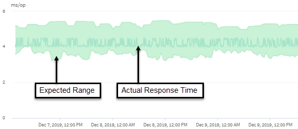

= Como o Unified Manager usa a latência da carga de trabalho para identificar problemas de desempenho
:allow-uri-read: 
:icons: font
:imagesdir: ../media/

[role="lead"]
A latência da carga de trabalho (tempo de resposta) é o tempo que um volume em um cluster leva para responder a solicitações de E/S de aplicativos clientes.  O Unified Manager usa a latência para detectar e alertá-lo sobre eventos de desempenho.

Uma latência alta significa que as solicitações de aplicativos para um volume em um cluster estão demorando mais que o normal.  A causa da alta latência pode estar no próprio cluster, devido à contenção em um ou mais componentes do cluster.  A alta latência também pode ser causada por problemas externos ao cluster, como gargalos de rede, problemas com o cliente que hospeda os aplicativos ou problemas com os próprios aplicativos.

[NOTE]
====
O Unified Manager monitora apenas a atividade da carga de trabalho no cluster.  Ele não monitora os aplicativos, os clientes ou os caminhos entre os aplicativos e o cluster.

====
Operações no cluster, como fazer backups ou executar desduplicação, que aumentam a demanda de componentes do cluster compartilhados por outras cargas de trabalho também podem contribuir para alta latência.  Se a latência real exceder o limite de desempenho dinâmico do intervalo esperado (previsão de latência), o Unified Manager analisará o evento para determinar se é um evento de desempenho que você pode precisar resolver.  A latência é medida em milissegundos por operação (ms/op).

No gráfico Latência Total na página Análise de Carga de Trabalho, você pode visualizar uma análise das estatísticas de latência para ver como a atividade de processos individuais, como solicitações de leitura e gravação, se compara às estatísticas gerais de latência.  A comparação ajuda a determinar quais operações têm a maior atividade ou se operações específicas têm atividade anormal que está afetando a latência de um volume.  Ao analisar eventos de desempenho, você pode usar as estatísticas de latência para determinar se um evento foi causado por um problema no cluster.  Você também pode identificar as atividades específicas da carga de trabalho ou os componentes do cluster que estão envolvidos no evento.

Este exemplo mostra o gráfico de latência.  A atividade real de tempo de resposta (latência) é uma linha azul e a previsão de latência (intervalo esperado) é verde.

[NOTE]
====
Pode haver lacunas na linha azul se o Unified Manager não conseguir coletar dados.  Isso pode ocorrer porque o cluster ou volume estava inacessível, o Unified Manager estava desativado durante esse período ou a coleta estava demorando mais do que o período de coleta de 5 minutos.

====