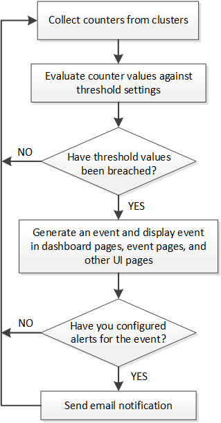

= O que acontece quando um evento é recebido
:allow-uri-read: 
:icons: font
:imagesdir: ../media/

[role="lead"]
Quando o Unified Manager recebe um evento, ele é exibido na página Painel, na página de inventário do Gerenciamento de Eventos, nas guias Resumo e Explorer da página Cluster/Desempenho e na página de inventário específica do objeto (por exemplo, a página de inventário Volumes/Saúde).

Quando o Unified Manager detecta várias ocorrências contínuas da mesma condição de evento para o mesmo componente de cluster, ele trata todas as ocorrências como um único evento, não como eventos separados.  A duração do evento é incrementada para indicar que o evento ainda está ativo.

Dependendo de como você configura as configurações na página Configuração de alerta, você pode notificar outros usuários sobre esses eventos.  O alerta faz com que as seguintes ações sejam iniciadas:

* Um e-mail sobre o evento pode ser enviado a todos os usuários administradores do Unified Manager.
* O evento pode ser enviado para destinatários de e-mail adicionais.
* Uma armadilha SNMP pode ser enviada ao receptor da armadilha.
* Um script personalizado pode ser executado para realizar uma ação.

Esse fluxo de trabalho é mostrado no diagrama a seguir.

