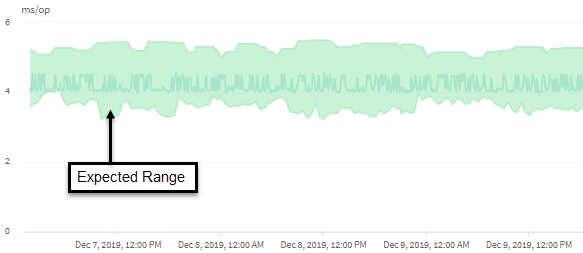

= Como a previsão de latência é usada na análise de desempenho
:allow-uri-read: 
:icons: font
:imagesdir: ../media/

[role="lead"]
O Unified Manager usa a previsão de latência para representar a atividade típica de latência de E/S (tempo de resposta) para suas cargas de trabalho monitoradas.  Ele alerta você quando a latência real de uma carga de trabalho está acima dos limites superiores da previsão de latência, o que aciona um evento de desempenho dinâmico, para que você possa analisar o problema de desempenho e tomar medidas corretivas para resolvê-lo.

A previsão de latência define a linha de base de desempenho para a carga de trabalho.  Com o tempo, o Unified Manager aprende com medições de desempenho anteriores para prever o desempenho esperado e os níveis de atividade para a carga de trabalho.  O limite superior do intervalo esperado estabelece o limite de desempenho dinâmico.  O Unified Manager usa a linha de base para determinar quando a latência real está acima ou abaixo de um limite, ou fora dos limites do intervalo esperado.  A comparação entre os valores reais e os valores esperados cria um perfil de desempenho para a carga de trabalho.

Quando a latência real de uma carga de trabalho excede o limite de desempenho dinâmico, devido à contenção em um componente do cluster, a latência é alta e a carga de trabalho tem um desempenho mais lento do que o esperado.  O desempenho de outras cargas de trabalho que compartilham os mesmos componentes do cluster também pode ser mais lento do que o esperado.

O Unified Manager analisa o evento de ultrapassagem de limite e determina se a atividade é um evento de desempenho.  Se a alta atividade de carga de trabalho permanecer consistente por um longo período de tempo, como várias horas, o Unified Manager considera a atividade normal e ajusta dinamicamente a previsão de latência para formar o novo limite de desempenho dinâmico.

Algumas cargas de trabalho podem ter atividade consistentemente baixa, onde a previsão de latência não tem uma alta taxa de mudança ao longo do tempo.  Para minimizar o número de eventos durante a análise de eventos de desempenho, o Unified Manager aciona um evento somente para volumes de baixa atividade cujas operações e latências são muito maiores do que o esperado.

Neste exemplo, a latência de um volume tem uma previsão de latência, em cinza, de 3,5 milissegundos por operação (ms/op) no seu valor mais baixo e 5,5 ms/op no seu valor mais alto.  Se a latência real, em azul, aumentar repentinamente para 10 ms/op, devido a um pico intermitente no tráfego de rede ou contenção em um componente do cluster, ela estará acima da previsão de latência e terá excedido o limite de desempenho dinâmico.

Quando o tráfego de rede diminui ou o componente do cluster não está mais em disputa, a latência retorna dentro da previsão de latência.  Se a latência permanecer em ou acima de 10 ms/op por um longo período de tempo, talvez seja necessário tomar medidas corretivas para resolver o evento.
