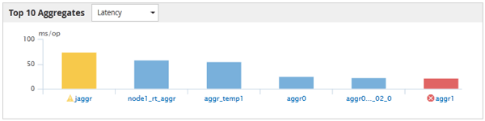

= Página dos Melhores Desempenhos
:allow-uri-read: 
:icons: font
:imagesdir: ../media/

[role="lead"]
A página Melhores Desempenhos exibe os objetos de armazenamento que têm o maior ou menor desempenho, com base no contador de desempenho selecionado.  Por exemplo, na categoria VMs de armazenamento, você pode exibir as SVMs que têm o maior IOPS, a maior latência ou os menores MB/s.  Esta página também mostra se algum dos melhores artistas tem algum evento de performance ativo (Novo ou Reconhecido).

A página Melhores desempenhos exibe no máximo 10 de cada objeto.  Observe que o objeto Volume inclui volumes FlexVol e FlexGroup .

* *Intervalo de tempo*
+
Você pode selecionar um intervalo de tempo para visualizar os melhores desempenhos; o intervalo de tempo selecionado se aplica a todos os objetos de armazenamento.  Intervalos de tempo disponíveis:

+
** Última hora
** Últimas 24 horas
** Últimas 72 horas (padrão)
** Últimos 7 dias

* *Métrica*
+
Clique no menu *Métrica* para selecionar um contador diferente.  As opções de contador são exclusivas para o tipo de objeto.  Por exemplo, os contadores disponíveis para o objeto *Volumes* são *Latência*, *IOPS* e *MB/s*.  Alterar o contador recarrega os dados do painel com os melhores desempenhos com base no contador selecionado.

+
Contadores disponíveis:

+
** Latência
** IOPS
** MB/s
** Capacidade de desempenho utilizada (para nós e agregados)
** Utilização (para nós e agregados)

* *Organizar*
+
Clique no menu *Classificar* para selecionar uma classificação crescente ou decrescente para o objeto e contador selecionados.  As opções são *Do maior para o menor* e *Do menor para o maior*.  Essas opções permitem que você visualize os objetos com o melhor ou o pior desempenho.

* *Balcão*
+
A barra do contador no gráfico mostra as estatísticas de desempenho de cada objeto, representadas como uma barra para esse item.  Os gráficos de barras são codificados por cores.  Se o contador não ultrapassar um limite de desempenho, a barra do contador será exibida em azul.  Se uma violação de limite estiver ativa (um evento novo ou reconhecido), a barra será exibida na cor do evento: eventos de aviso serão exibidos em amarelo (image:../media/treemapstatus_warning_png.gif["Ícone para TreeMap – Status de aviso"] ), e eventos críticos são exibidos em vermelho (image:../media/treemapred_png.gif["Ícone para TreeMap – Cor vermelha"] ).  Violações de limites são ainda indicadas por ícones indicadores de eventos de gravidade para eventos de aviso e críticos.

+

+
Para cada gráfico, o eixo X exibe os melhores desempenhos para o tipo de objeto selecionado.  O eixo Y exibe unidades aplicáveis ao contador selecionado.  Clicar no link do nome do objeto abaixo de cada elemento do gráfico de barras verticais navega até a página de destino de desempenho do objeto selecionado.

* *Indicador de evento de gravidade*
+
O ícone indicador *Evento de gravidade* é exibido à esquerda do nome de um objeto para eventos críticos ativos (image:../media/sev_critical_um60.png["Ícone para gravidade do evento – crítico"] ) ou aviso (image:../media/sev_warning_um60.png["Ícone para gravidade do evento – aviso"] ) eventos nos gráficos dos melhores desempenhos.  Clique no ícone indicador *Evento de gravidade* para visualizar:

+
** *Um evento*
+
Navega até a página de detalhes do evento.

** *Dois ou mais eventos*
+
Navega até a página Inventário de eventos, que é filtrada para exibir todos os eventos do objeto selecionado.

* *Botão Exportar*
+
Cria um `.csv` arquivo que contém os dados que aparecem na barra do contador.  Você pode optar por criar o arquivo para o cluster único que está visualizando ou para todos os clusters no data center.

