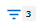

= Filtrar conteúdo da página de inventário
:allow-uri-read: 
:icons: font
:imagesdir: ../media/

[role="lead"]
Você pode filtrar dados da página de inventário no Unified Manager para localizar dados rapidamente com base em critérios específicos.  Você pode usar a filtragem para restringir o conteúdo das páginas do Unified Manager e mostrar apenas os resultados nos quais você está interessado.  Isso fornece um método muito eficiente de exibir apenas os dados nos quais você está interessado.

Use *Filtragem* para personalizar a visualização em grade com base em suas preferências.  As opções de filtro disponíveis são baseadas no tipo de objeto visualizado na grade.  Se filtros estiverem aplicados no momento, o número de filtros aplicados será exibido à direita do botão Filtro.

Três tipos de parâmetros de filtro são suportados.

|===
| Parâmetro | Validação 

 a| 
String (texto)
 a| 
Os operadores são *contém*, *começa com*, *termina com* e *não contém*.

 a| 
Número
 a| 
Os operadores são *maior que*, *menor que*, *no último* e *entre*.

 a| 
Enum (texto)
 a| 
Os operadores são *is* e *is not*.

|===
Os campos Coluna, Operador e Valor são necessários para cada filtro; os filtros disponíveis refletem as colunas filtráveis na página atual.  O número máximo de filtros que você pode aplicar é quatro.  Os resultados filtrados são baseados em parâmetros de filtro combinados.  Os resultados filtrados se aplicam a todas as páginas da sua pesquisa filtrada, não apenas à página exibida no momento.

Você pode adicionar filtros usando o painel Filtragem.

. No topo da página, clique no botão *Filtro*.  O painel Filtragem é exibido.
. Clique na lista suspensa à esquerda e selecione um objeto; por exemplo, _Cluster_ ou um contador de desempenho.
. Clique na lista suspensa central e selecione o operador que deseja usar.
. Na última lista, selecione ou insira um valor para completar o filtro para aquele objeto.
. Para adicionar outro filtro, clique em *+Adicionar filtro*.  Um campo de filtro adicional é exibido.  Complete este filtro usando o processo descrito nas etapas anteriores.  Observe que ao adicionar seu quarto filtro, o botão *+Adicionar Filtro* não será mais exibido.
. Clique em *Aplicar filtro*.  As opções de filtro são aplicadas à grade e o número de filtros é exibido à direita do botão Filtro.
. Use o painel Filtragem para remover filtros individuais clicando no ícone de lixeira à direita do filtro a ser removido.
. Para remover todos os filtros, clique em *Redefinir* na parte inferior do painel de filtragem.

== Exemplo de filtragem

A ilustração mostra o painel Filtragem com três filtros.  O botão *+Adicionar filtro* é exibido quando você tem menos do que o máximo de quatro filtros.

image::../media/opm_filtering_panel_draft_3.gif[Uma captura de tela da interface do usuário que mostra o painel Filtragem com três filtros.]

Após clicar em *Aplicar filtro*, o painel Filtragem fecha, aplica seus filtros e mostra o número de filtros aplicados ( ).
