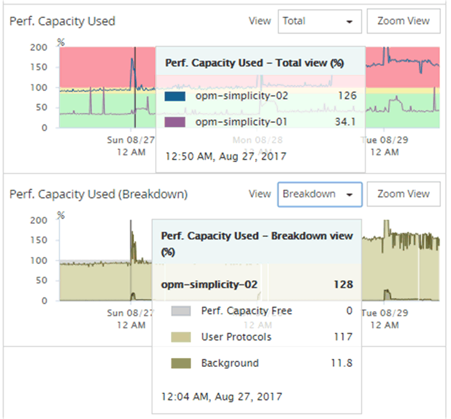

= Visualize gráficos de contadores de capacidade de desempenho para identificar problemas
:allow-uri-read: 
:icons: font
:imagesdir: ../media/

[role="lead"]
Você pode visualizar gráficos de capacidade de desempenho usada para nós e agregados na página Performance Explorer.  Isso permite que você visualize dados detalhados de capacidade de desempenho para os nós e agregados selecionados para um período de tempo específico.

O gráfico de contador padrão exibe os valores de capacidade de desempenho usados para os nós ou agregados selecionados.  O gráfico do contador de detalhamento exibe os valores totais de capacidade de desempenho para o objeto raiz separados por uso com base nos protocolos do usuário versus processos do sistema em segundo plano.  Além disso, a quantidade de capacidade de desempenho livre também é mostrada.

[NOTE]
====
Como algumas atividades em segundo plano associadas ao gerenciamento de sistemas e dados são identificadas como cargas de trabalho do usuário e categorizadas como protocolos do usuário, a porcentagem de protocolos do usuário pode parecer artificialmente alta quando esses processos são executados.  Esses processos geralmente são executados por volta da meia-noite, quando o uso do cluster é baixo.  Se você observar um pico na atividade do protocolo do usuário por volta da meia-noite, verifique se os trabalhos de backup do cluster ou outras atividades em segundo plano estão configurados para serem executados naquele horário.

====
.Passos
. Selecione a aba *Explorer* de um nó ou página de destino agregada.
. No painel *Gráficos do contador*, clique em *Escolher gráficos* e selecione *Desempenho.  Gráfico de Capacidade Utilizada*.
. Role para baixo até conseguir visualizar o gráfico.
+
As cores do gráfico padrão mostram quando o objeto está na faixa ideal (amarelo), quando o objeto está subutilizado (verde) e quando o objeto está superutilizado (vermelho).  O gráfico de detalhamento mostra detalhes detalhados da capacidade de desempenho somente para o objeto raiz.

+

. Se você quiser visualizar qualquer um dos gráficos em tamanho real, clique em *Visualização com Zoom*.
+
Dessa forma, você pode abrir vários gráficos de contadores em janelas separadas para comparar valores de capacidade de desempenho usados com valores de IOPS ou MBps no mesmo período.

