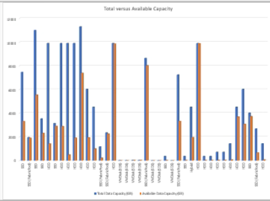

= Crie um relatório para mostrar gráficos de capacidade total agregada versus capacidade disponível
:allow-uri-read: 
:icons: font
:imagesdir: ../media/

[role="lead"]
Você pode criar um relatório para analisar a capacidade total e comprometida do armazenamento em um formato de gráfico do Excel.

.Antes de começar
* Você deve ter a função de Administrador de Aplicativos ou Administrador de Armazenamento.

Use as seguintes etapas para abrir uma exibição Saúde: Todos os agregados, baixe a exibição no Excel, crie um gráfico de capacidade total e comprometida, carregue o arquivo Excel personalizado e agende o relatório final.

.Passos
. No painel de navegação esquerdo, clique em *Armazenamento* > *Agregados*.
. Selecione *Relatórios* > *Baixar Excel*.
+
image::../media/download_excel_menu.png[Uma captura de tela da interface do usuário que mostra como baixar o Excel a partir de relatórios.]

+
Dependendo do seu navegador, pode ser necessário clicar em *OK* para salvar o arquivo.

. No Excel, abra o arquivo baixado.
. Se necessário, clique em *Ativar edição*.
. Na planilha de dados, clique com o botão direito do mouse na coluna Tipo e selecione *Classificar* > *Classificar de A a Z*.
+
image::../media/sort_01.png[Uma captura de tela da interface do usuário que mostra como selecionar a classificação na coluna de tipo.]

+
Isso organizará seus dados por tipo de armazenamento, como:

+
** HDD
** Híbrido
** SSD
** SSD (FabricPool)

. Selecione o `Type, Total Data Capacity,` e `Available Data Capacity` colunas.
. No menu *Inserir*, selecione um `3-D column` gráfico.
+
O gráfico aparece na folha de dados.

+
image::../media/3d_column_01.png[Uma captura de tela da interface do usuário que mostra o gráfico de colunas 3D.]

. Clique com o botão direito do mouse no gráfico e selecione *Mover gráfico*.
. Selecione *Nova planilha* e nomeie a planilha como *Gráficos de armazenamento total*.
+
[NOTE]
====
Certifique-se de que a nova planilha apareça depois das planilhas de informações e dados.

====
. Nomeie o título do gráfico como *Capacidade Total versus Capacidade Disponível*.
. Usando os menus *Design* e *Formato*, disponíveis quando o gráfico é selecionado, você pode personalizar a aparência do gráfico.
. Quando estiver satisfeito, salve o arquivo com suas alterações.  Não altere o nome ou o local do arquivo.
+

. No Unified Manager, selecione *Relatórios* > *Carregar Excel*.
+
[NOTE]
====
Certifique-se de que você está na mesma visualização onde baixou o arquivo do Excel.

====
. Selecione o arquivo Excel que você modificou.
. Clique em *Abrir*.
. Clique em *Enviar*.
+
Uma marca de seleção aparece ao lado do item de menu *Relatórios* > *Carregar Excel*.

+
image::../media/upload_excel.png[Uma captura de tela da interface do usuário que mostra como fazer upload do Excel para relatórios.]

. Clique em *Relatórios agendados*.
. Clique em *Adicionar agendamento* para adicionar uma nova linha à página *Agendamentos de relatórios* para que você possa definir as características do agendamento para o novo relatório.
+
[NOTE]
====
Selecione o formato *XLSX* para o relatório.

====
. Digite um nome para o agendamento do relatório e preencha os outros campos do relatório e clique na marca de seleção (image:../media/blue_check.gif[""] ) no final da linha.
+
O relatório é enviado imediatamente como um teste.  Depois disso, o relatório é gerado e enviado por e-mail aos destinatários listados usando a frequência especificada.

Com base nos resultados mostrados no relatório, talvez você queira balancear a carga em seus agregados.
