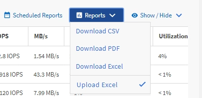

= Crie um relatório para visualizar agregados que tenham mais IOPS disponíveis
:allow-uri-read: 
:icons: font
:imagesdir: ../media/

[role="lead"]
Este relatório mostra quais agregados têm mais IOPS disponíveis por tipo de agregado no qual você pode provisionar novas cargas de trabalho.

.Antes de começar
* Você deve ter a função de Administrador de Aplicativos ou Administrador de Armazenamento.

Use as seguintes etapas para abrir uma exibição Saúde: Todos os volumes, baixar a exibição no Excel, criar um gráfico de capacidade disponível, carregar o arquivo Excel personalizado e agendar o relatório final.

.Passos
. No painel de navegação esquerdo, clique em *Armazenamento* > *Agregados*.
. Selecione *Desempenho: Todos os agregados* no menu suspenso *Exibir*.
. Selecione *Mostrar/Ocultar* para mostrar o `Available IOPS` coluna e ocultar o `Cluster FQDN, Inactive Data Reporting,` e `Threshold Policy` colunas.
. Arraste e solte o `Available IOPS` e `Free Capacity` colunas ao lado do `Type` coluna.
. Nomeie e salve a visualização personalizada `Available IOPS Per Aggr.`
. Selecione *Relatórios* > *Baixar Excel*.
+
image::../media/download_excel_menu.png[Uma captura de tela da interface do usuário que mostra como baixar o Excel a partir de relatórios.]

+
Dependendo do seu navegador, pode ser necessário clicar em *OK* para salvar o arquivo.

. Se necessário, clique em *Ativar edição*.
. No Excel, abra o arquivo baixado.
. Na planilha de dados, clique no pequeno triângulo no canto superior esquerdo da planilha para selecionar a planilha inteira.
. Na faixa de opções *Dados*, selecione *Classificar* na `Sort & Filter area.`
. Defina os seguintes níveis de classificação:
+
.. Especifique *Classificar por* como `Available IOPS` (IOPS), o *Sort On* como `Cell Values,` e a *Ordem* como `Largest to Smallest.`
.. Clique em *Adicionar nível*.
.. Especifique *Classificar por* como `Type` , o *Classificar* como `Cell Values,` e a *Ordem* como `Z to A.`
.. Clique em *Adicionar nível*.
.. Especifique *Classificar por* como `Free Capacity (GB),` o *Classificar* como `Cell Values,` e a *Ordem* como `Largest to Smallest.`
.. Clique em *OK*.

. Salve e feche o arquivo do Excel.
. No Unified Manager, selecione *Relatórios* > *Carregar Excel*.
+
[NOTE]
====
Certifique-se de que você está na mesma visualização onde baixou o arquivo do Excel.

====
. Selecione o arquivo Excel que você modificou, neste caso `performance-aggregates-<date>.xlsx.`
. Clique em *Abrir*.
. Clique em *Enviar*.
+
Uma marca de seleção aparece ao lado do item de menu *Relatórios* > *Carregar Excel*.

+

. Clique em *Relatórios agendados*.
. Clique em *Adicionar agendamento* para adicionar uma nova linha à página Agendamentos de relatórios para que você possa definir as características do agendamento para o novo relatório.
. Digite um nome para o agendamento do relatório e preencha os outros campos do relatório e clique na marca de seleção (image:../media/blue_check.gif[""] ) no final da linha.
+
[NOTE]
====
Selecione o formato *XLSX* para o relatório.

====
+
O relatório é enviado imediatamente como um teste.  Depois disso, o relatório é gerado e enviado por e-mail aos destinatários listados usando a frequência especificada.

Com base nos resultados mostrados no relatório, talvez você queira provisionar novas cargas de trabalho nos agregados que têm o maior IOPS disponível.
