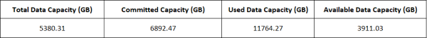

= Crie um relatório para mostrar uma tabela e um gráfico de capacidade agregada
:allow-uri-read: 
:icons: font
:imagesdir: ../media/

[role="lead"]
Você pode criar um relatório para analisar a capacidade em um arquivo do Excel usando totais somados e o formato de gráfico de colunas agrupadas.

.Antes de começar
* Você deve ter a função de Administrador de Aplicativos ou Administrador de Armazenamento.

Use as seguintes etapas para abrir uma exibição Saúde: Todos os agregados, baixar a exibição no Excel, criar um gráfico de capacidade disponível, carregar o arquivo Excel personalizado e agendar o relatório final.

.Passos
. No painel de navegação esquerdo, clique em *Armazenamento* > *Agregados*.
. Selecione *Relatórios* > *Baixar Excel*.
+
image::../media/download_excel_menu.png[Uma captura de tela da interface do usuário que mostra como baixar o Excel a partir de relatórios.]

+
Dependendo do seu navegador, pode ser necessário clicar em *OK* para salvar o arquivo.

. Se necessário, clique em *Ativar edição*.
. No Excel, abra o arquivo baixado.
. Crie uma nova planilha (image:../media/excel_new_sheet_icon.png[""] ) depois do `data` planilha e nomeie-a como *Capacidade Total de Dados*.
. Adicione as seguintes colunas na nova planilha Capacidade Total de Dados:
+
.. Capacidade total de dados (GB)
.. Capacidade Comprometida (GB)
.. Capacidade de dados usada (GB)
.. Capacidade de dados disponível (GB)

. Na primeira linha de cada coluna, insira a fórmula a seguir, certificando-se de que ela faça referência à planilha de dados (dados!) e aos especificadores de coluna e linha corretos para os dados capturados (a Capacidade Total de Dados extrai dados da coluna E, linhas 2 a 20).
+
.. =SOMA(dados!E$2:dados!E$20)
.. =SOMA(dados!F$2:dados!F$50)
.. =SOMA(dados!G$2:dados!G$50)
.. =SOMA(dados!H$2:dados!H$50)

+
A fórmula totaliza cada coluna com base nos dados atuais.

. Na planilha de dados, selecione as colunas *Capacidade total de dados (GB)* e *Capacidade comprometida (GB)*.
. Selecione *Gráficos recomendados* no menu *Inserir* e selecione o gráfico *Colunas agrupadas*.
. Clique com o botão direito do mouse no gráfico e selecione *Mover gráfico* para movê-lo para o `Total Data Capacity` folha.
. Usando os menus *Design* e *Formato*, que estão disponíveis quando o gráfico é selecionado, você pode personalizar a aparência do gráfico.
. Quando estiver satisfeito, salve o arquivo com suas alterações.  Não altere o nome ou o local do arquivo.
+
image::../media/cluster_column_chart_2.png[Uma captura de tela da interface do usuário de um gráfico que mostra os dados totais e a capacidade comprometida.]

. No Unified Manager, selecione *Relatórios* > *Carregar Excel*.
+
[NOTE]
====
Certifique-se de que você está na mesma visualização onde baixou o arquivo do Excel.

====
. Selecione o arquivo Excel que você modificou.
. Clique em *Abrir*.
. Clique em *Enviar*.
+
Uma marca de seleção aparece ao lado do item de menu *Relatórios* > *Carregar Excel*.

+
image::../media/upload_excel.png[Uma captura de tela da interface do usuário que mostra como fazer upload do Excel para relatórios.]

. Clique em *Relatórios agendados*.
. Clique em *Adicionar agendamento* para adicionar uma nova linha à página Agendamentos de relatórios para que você possa definir as características do agendamento para o novo relatório.
+
[NOTE]
====
Selecione o formato *XLSX* para o relatório.

====
. Digite um nome para o agendamento do relatório e preencha os outros campos do relatório e clique na marca de seleção (image:../media/blue_check.gif[""] ) no final da linha.
+
O relatório é enviado imediatamente como um teste.  Depois disso, o relatório é gerado e enviado por e-mail aos destinatários listados usando a frequência especificada.

Com base nos resultados mostrados no relatório, talvez você queira investigar como usar melhor a capacidade disponível em sua rede.
