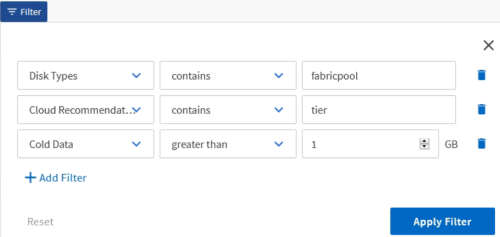

= Filtrar dados
:allow-uri-read: 
:icons: font
:imagesdir: ../media/

[role="lead"]
Filtre os dados para garantir que os resultados correspondam aos requisitos do seu relatório.  A filtragem permite que você exiba apenas os dados nos quais está interessado.

.Passos
. Clique no ícone de filtro para adicionar filtros para focar os resultados que você deseja visualizar e, em seguida, clique em *Aplicar filtro*.
+

. Nomeie a exibição não salva para salvar suas alterações.

