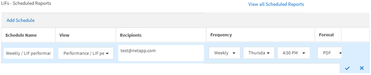

= Agendar um relatório
:allow-uri-read: 
:icons: font
:imagesdir: ../media/

[role="lead"]
Depois de ter uma exibição ou arquivo Excel que você deseja agendar para geração e distribuição regulares, você pode agendar o relatório.

.Antes de começar
* Você deve ter a função de Administrador de Aplicativos ou Administrador de Armazenamento.
* Você deve ter configurado as configurações do servidor SMTP na página *Geral* > *Notificações* para que o mecanismo de relatórios possa enviar relatórios como anexos de e-mail para a lista de destinatários do servidor do Unified Manager.
* O servidor de e-mail deve ser configurado para permitir o envio de anexos com os e-mails gerados.

Use as etapas a seguir para testar e agendar a geração de um relatório para uma exibição.  Selecione ou personalize a visualização que deseja usar.  O procedimento a seguir usa uma visualização de rede que mostra o desempenho das suas interfaces de rede, mas você pode usar qualquer visualização que desejar.

.Passos
. Abra sua visualização.  Este exemplo usa a exibição de rede padrão que mostra o desempenho do LIF.  No painel de navegação esquerdo, clique em *Rede > Interfaces de rede*.
. Personalize a visualização conforme necessário usando os recursos integrados do Unified Manager.
. Depois de personalizar a visualização, você pode fornecer um nome exclusivo no campo *Visualização* e clicar na marca de seleção para salvá-lo.
+
image::../media/view_save.gif[Uma captura de tela da interface do usuário que mostra como salvar uma visualização.]

. Você pode usar os recursos avançados do Microsoft® Excel para personalizar seu relatório. Para mais detalhes, vejalink:task_use_excel_to_customize_your_report.html["Usando o Excel para personalizar seu relatório"] .
. Para ver a saída antes de agendá-la ou compartilhá-la:
+
[cols="2*"]
|===
| Opção | Descrição 

 a| 
*Se você usou o Excel para personalizar o relatório*
 a| 
Visualize o arquivo Excel baixado existente.

 a| 
*Se você não usou o Excel para personalizar o relatório*
 a| 
Baixe o relatório como um arquivo *CSV*, *PDF* ou *XLSX*.

|===
+
Abra o arquivo com um aplicativo instalado, como o Microsoft Excel (CSV/XSLX) ou o Adobe Acrobat (PDF).

. Se estiver satisfeito com o relatório, clique em *Relatórios agendados*.
. Na página Cronogramas de relatórios, clique em *Adicionar cronograma*.
. Aceite o nome padrão, que é uma combinação do nome da exibição e da frequência, ou personalize o *nome da programação*.
. Para testar o relatório agendado pela primeira vez, adicione-se apenas como *destinatário*.  Quando estiver satisfeito, adicione os endereços de e-mail de todos os destinatários do relatório.
. Especifique com que frequência o relatório será gerado e enviado aos destinatários.  Você pode escolher *Diário*, *Semanal* ou *Mensal*.
. Selecione o formato, *PDF*, *CSV* ou *XSLX*.
+
[NOTE]
====
Para relatórios em que você usou o Excel para personalizar o conteúdo, sempre selecione *XSLX*.

====
. Clique na marca de seleção (image:../media/blue_check.gif[""] ) para salvar o agendamento do relatório.
+

+
O relatório é enviado imediatamente como um teste.  Depois disso, o relatório é gerado e enviado por e-mail aos destinatários listados usando a frequência agendada.

