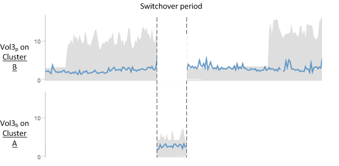

= Comportamento do volume durante a comutação e o retorno
:allow-uri-read: 
:icons: font
:imagesdir: ../media/

[role="lead"]
Eventos que acionam uma alternância ou retorno fazem com que volumes ativos sejam movidos de um cluster para outro no grupo de recuperação de desastres.  Os volumes no cluster que estavam ativos e fornecendo dados aos clientes são interrompidos, e os volumes no outro cluster são ativados e começam a fornecer dados.  O Unified Manager monitora apenas os volumes que estão ativos e em execução.

Como os volumes são movidos de um cluster para outro, é recomendável monitorar ambos os clusters.  Uma única instância do Unified Manager pode monitorar ambos os clusters em uma configuração MetroCluster , mas às vezes a distância entre os dois locais exige o uso de duas instâncias do Unified Manager para monitorar ambos os clusters.  A figura a seguir mostra uma única instância do Unified Manager:

image::../media/opm_mcc_switchover.gif[Uma captura de tela da interface do usuário que mostra uma única instância do Unified Manager.]

Os volumes com p em seus nomes indicam os volumes primários, e os volumes com b em seus nomes são volumes de backup espelhados criados pelo SnapMirror.

Durante a operação normal:

* O cluster A tem dois volumes ativos: Vol1p e Vol2p.
* O cluster B tem dois volumes ativos: Vol3p e Vol4p.
* O cluster A tem dois volumes inativos: Vol3b e Vol4b.
* O cluster B tem dois volumes inativos: Vol1b e Vol2b.

Informações referentes a cada um dos volumes ativos (estatísticas, eventos e assim por diante) são coletadas pelo Unified Manager.  As estatísticas Vol1p e Vol2p são coletadas pelo Cluster A, e as estatísticas Vol3p e Vol4p são coletadas pelo Cluster B.

Após uma falha catastrófica causar uma troca de volumes ativos do Cluster B para o Cluster A:

* O cluster A tem quatro volumes ativos: Vol1p, Vol2p, Vol3b e Vol4b.
* O cluster B tem quatro volumes inativos: Vol3p, Vol4p, Vol1b e Vol2b.

Como durante a operação normal, as informações referentes a cada um dos volumes ativos são coletadas pelo Unified Manager.  Mas neste caso, as estatísticas Vol1p e Vol2p são coletadas pelo Cluster A, e as estatísticas Vol3b e Vol4b também são coletadas pelo Cluster A.

Observe que Vol3p e Vol3b não são os mesmos volumes, porque estão em clusters diferentes.  As informações no Unified Manager para Vol3p não são as mesmas do Vol3b:

* Durante a mudança para o Cluster A, as estatísticas e eventos do Vol3p não ficam visíveis.
* Na primeira troca, o Vol3b parece um novo volume sem informações históricas.

Quando o Cluster B é reparado e uma troca é realizada, o Vol3p fica ativo novamente no Cluster B, com as estatísticas históricas e uma lacuna de estatísticas para o período durante a troca.  Vol3b não pode ser visualizado no Cluster A até que outra troca ocorra:

[NOTE]
====
* Os volumes do MetroCluster que estão inativos, por exemplo, Vol3b no Cluster A após o switchback, são identificados com a mensagem "`Este volume foi excluído`".  O volume não é realmente excluído, mas não está sendo monitorado pelo Unified Manager porque não é o volume ativo.
* Se um único Unified Manager estiver monitorando ambos os clusters em uma configuração MetroCluster , a pesquisa de volume retornará informações para qualquer volume que esteja ativo naquele momento.  Por exemplo, uma busca por "Vol3" retornaria estatísticas e eventos para Vol3b no Cluster A se uma troca tivesse ocorrido e Vol3 tivesse se tornado ativo no Cluster A.

====